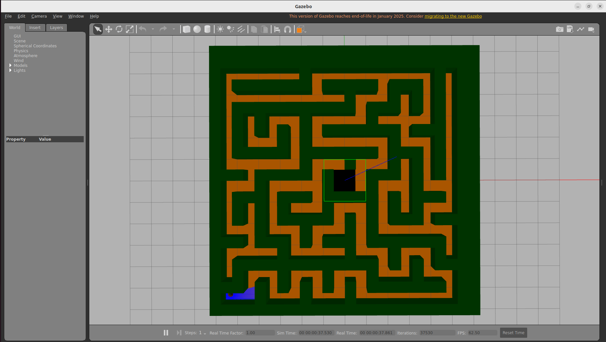
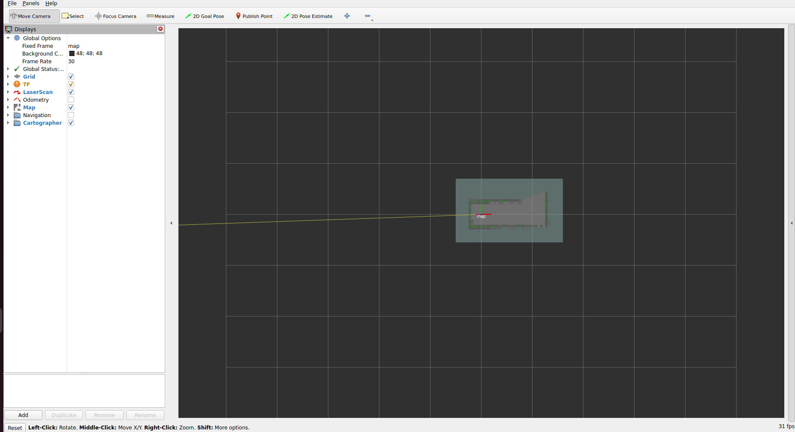
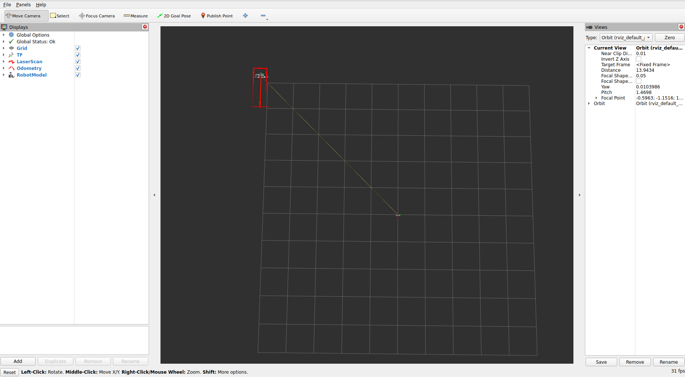

# ROS Navigator Challenge

Welcome to the ROS Navigator Challenge – where code meets navigation! This competition requires participants to develop an efficient ROS-based navigation algorithm for a simulated TurtleBot in a maze. The goal is to autonomously guide your bot from the starting point to the centre of the maze with the fewest possible steps.

> **Code, Navigate, Conquer!**

## Overview

This repository is built on top of the [TurtleBot3](https://github.com/ROBOTIS-GIT/turtlebot3) and [turtlebot3_msgs](https://github.com/ROBOTIS-GIT/turtlebot3_msgs) projects, with additional models and functionalities specifically added for the challenge.

## Prerequisites

- **Operating System:** Ubuntu 22.04 (Dual boot is recommended over using a Linux emulator)
- **ROS 2 Distribution:** ROS 2 Humble

## ROS 2 Humble Installation

Follow these steps to install ROS 2 Humble:

```bash
sudo apt update && sudo apt install locales
sudo locale-gen en_US en_US.UTF-8
sudo update-locale LC_ALL=en_US.UTF-8 LANG=en_US.UTF-8
export LANG=en_US.UTF-8

sudo apt install software-properties-common
sudo add-apt-repository universe

sudo apt update && sudo apt install curl -y
sudo curl -sSL https://raw.githubusercontent.com/ros/rosdistro/master/ros.key -o /usr/share/keyrings/ros-archive-keyring.gpg

echo "deb [arch=$(dpkg --print-architecture) signed-by=/usr/share/keyrings/ros-archive-keyring.gpg] http://packages.ros.org/ros2/ubuntu $(. /etc/os-release && echo $UBUNTU_CODENAME) main" | sudo tee /etc/apt/sources.list.d/ros2.list > /dev/null

sudo apt update && sudo apt upgrade -y
sudo apt install ros-humble-desktop
sudo apt install ros-dev-tools

source /opt/ros/humble/setup.bash && echo "source /opt/ros/humble/setup.bash" >> ~/.bashrc
```

For more details, check the [official ROS 2 Humble installation guide](https://docs.ros.org/en/humble/Installation/Ubuntu-Install-Debs.html).

## Workspace Setup

Set up your ROS 2 workspace and clone this repository:

```bash
mkdir -p ~/ros2_ws/src
cd ~/ros2_ws/src 
git clone https://github.com/parth12062005/TurtleBotMaze
cd ..
```

Install dependencies and build the workspace:

```bash
# Initialize rosdep if you haven't already
sudo rosdep init
rosdep update
rosdep install --from-paths src --ignore-src -r -y

# Install required Python packages
pip3 install lark catkin_pkg empy==3.3.2

# Build the workspace
colcon build
```

## Running the Simulation

To run the simulation, open a new terminal and execute:

```bash
source ~/ros2_ws/install/setup.bash
export TURTLEBOT_MODEL=burger
ros2 launch turtlebot3_gazebo turtlebot3_maze.launch.py
```

You should see a simulation similar to the image below:



Once the simulation is running, you can list the active ROS topics with:

```bash
ros2 topic list
```

The expected topics include:

- `/clock`
- `/cmd_vel`
- `/imu`
- `/joint_states`
- `/odom`
- `/parameter_events`
- `/performance_metrics`
- `/robot_description`
- `/rosout`
- `/scan`
- `/tf`
- `/tf_static`

Pay particular attention to `/odom`, `/imu`, and `/scan` to generate appropriate commands for `/cmd_vel`.

## Additional Commands for Experimentation

After the simulation starts, you can further experiment with teleoperation, SLAM using Cartographer, and visualization using RViz,:

1. **Teleoperation:**  
   To manually control your TurtleBot, launch the teleop keyboard:

   ```bash
   ros2 run turtlebot3_teleop teleop_keyboard
   ```

2. **Cartographer SLAM:**  
   To enable Cartographer for SLAM, run:

   ```bash
   ros2 launch turtlebot3_cartographer cartographer.launch.py
   ```
   - 

3. **RViz Visualization:**  
   For visualization, open RViz with the provided configuration:

   ```bash
   rviz2 -d ros2_ws/src/TurtleBotMaze/turtlebot3_simulations/turtlebot3_gazebo/rviz/tb3_gazebo.rviz
   ```
   - 
  
**Also read official TurtleBot3 documentation for more details**

## Competition Details

### Challenge Objective

- **Start Position:** (-5.25, -5.25)
- **Goal:** Reach a central black square (1x1, centered at the origin)

### Allowed Sensors

- Lidar
- Proximity sensors
- Wheel odometry
- IMU

*Note: Any sensor that provides a top-down view or additional vision beyond the walls is strictly prohibited.*

### Registration & Eligibility

- **Eligibility:** Open to all students; teams may consist of up to 3 members. Cross-college teams are allowed.
- **Registration Deadline:** Must be completed by **5 April 2025**.
- **Code of Conduct:** All participants must adhere to the rules with integrity and fairness. Any form of cheating or unauthorized modifications will lead to immediate disqualification.

### Competition Rounds

#### Round 1: Method Summary Submission

- **Task:** Submit a detailed proposal or report outlining your approach, algorithms, and expected performance.
- **Evaluation:** Proposals will be reviewed based on feasibility, innovation, and adherence to the challenge constraints.
- **Outcome:** Only selected teams will progress to Round 2.

#### Round 2: Maze Navigation Challenge

- **Task:** Submit your navigation solution as a Python script or ROS package.
- **Maze Setup:** A new maze will be generated for this round. Your bot must navigate to the centre of the maze.
- **Attempts:** Each team is allowed two attempts per maze. The best attempt (with the fewest steps) will be considered for ranking.
- **Timeout:** If the bot gets stuck for more than 30 seconds, the attempt is deemed invalid.
- **Scoring:** 
  - Primary metric: Number of steps taken to reach the centre.
  - Tie-breaker: Lowest total net steps across both attempts.
- **Penalties:** Collisions with walls will incur a penalty (exact criteria to be decided).

## Recommendations

### General Navigation

- Leverage data from your first attempt to optimize your solution for the second.
- Test your solution thoroughly on various maze configurations to ensure robustness.

### SLAM Recommendations

- **Algorithm Selection:**  
  While ROS2 Cartographer is a popular choice, also consider exploring alternatives like RTAB-Map or SLAM Toolbox based on your familiarity and the specific requirements of your navigation strategy.

- **Sensor Calibration:**  
  Ensure that your Lidar, IMU, and wheel odometry sensors are well-calibrated. Poor calibration can lead to significant errors in mapping and localization.

- **Parameter Tuning:**  
  Spend time tuning SLAM parameters such as loop closure detection, map resolution, and update frequencies. Adjust these parameters based on test runs to balance between accuracy and real-time performance.

- **Environmental Testing:**  
  Run simulations in different maze configurations to understand how varying environmental factors affect SLAM performance. This can help you build a more robust solution.

- **Documentation & Community:**  
  Refer to the official documentation of your chosen SLAM package. Many community forums and ROS answers can provide valuable insights and troubleshooting tips during parameter tuning and deployment.

- **Integration:**  
  Ensure that your SLAM algorithm integrates seamlessly with your navigation stack. Validate that the data published by SLAM (such as the map and pose estimates) are accurate and timely for your path planning and control modules.

### Additional Tips

- Consider using ROS2 tools for visualization (e.g., RViz) to debug and monitor the SLAM process.
- Regularly update your system and dependencies to incorporate improvements and bug fixes from the community.
- Work collaboratively and share insights with peers to overcome common challenges in SLAM integration.

## Event Heads

- **Parth Sachdeva**  
  Phone: +91 9149663246  
  Email: 2023ucs0105@iitjammu.ac.in

- **Purushartha Gupta**  
  Phone: +91 9369573768  
  Email: 2023uce0062@iitjammu.ac.in

